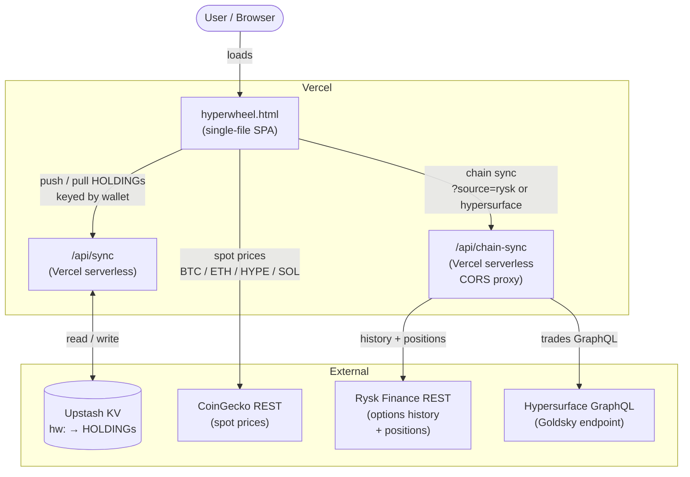
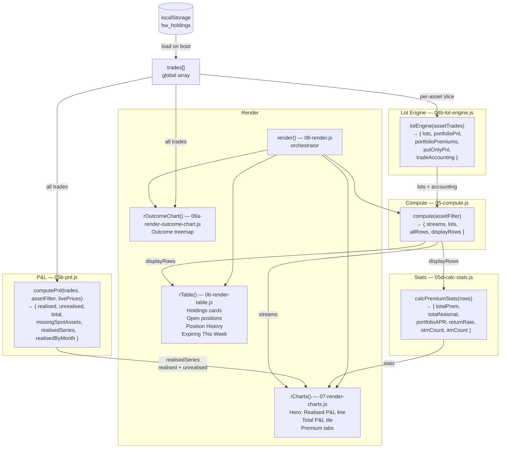

# HyperWheel — Architecture

> **Living document.** Update when module boundaries or external interfaces change.
> Maintained by agent during PR review or grill-with-docs sessions — no automation required.

---

## System Context

Who the app talks to and why.



**Notes:**
- Chain sync is skipped when `hasProxy()` returns false (i.e. served over `file://`).
- Cloud sync pushes **only `type === 'HOLDING'` trades**; options history is local-only.
- CoinGecko is called directly from the browser (no proxy needed — no auth, no CORS issue).

---

## Core Data Flow

How a trade becomes a number on screen.



**Key invariants visible here:**
- `lotEngine` is the single source of truth for lot arithmetic (net cost, assigned-PUT premium credit).
- `computePnl` and `calcPremiumStats` answer different questions and must not be conflated — see CONTEXT.md.
- `render()` is a pure re-render from current `trades[]`; there is no incremental update path.
- `livePrices{}` (populated by the CoinGecko fetch) flows into `computePnl` for unrealised P&L only.
```
